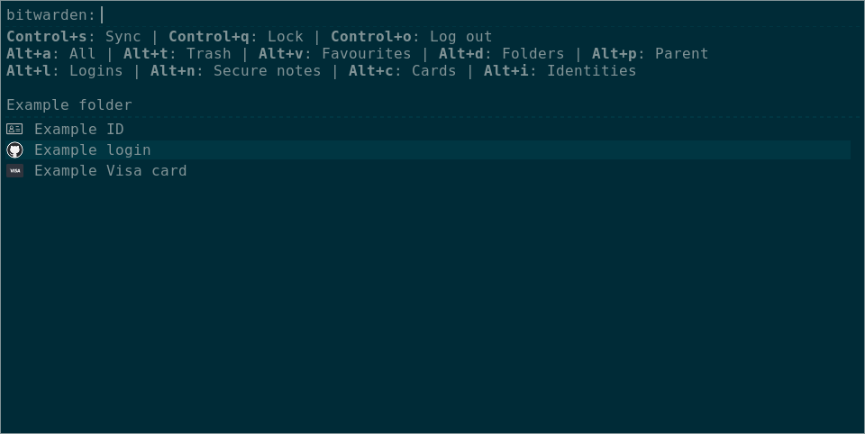
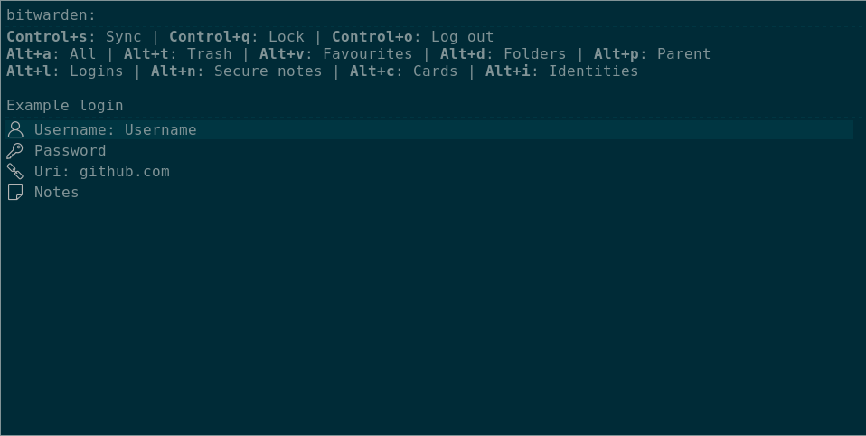

# rofi-bw

Rofi-bw is a read-only interface to your Bitwarden vault, built on Rofi.




I created this
after becoming frustrated with the slowness and unreliability of existing interfaces.
It aims to resolve both those issues
as well as add many more nice features.

## Usage

Simply run `rofi-bw` on the command line.
If no existing `rofi-bw` process is running,
after showing the vault for the first time
it will continue to run,
allowing other invocations of `rofi-bw`
to show the vault without re-asking the master password.

Command-line syntax is detailed in the help page,
whose content is copied below:

```
rofi-bw
Rofi interface to Bitwarden

USAGE:
    rofi-bw [OPTIONS]

OPTIONS:
    -c, --config-file <CONFIG_FILE>
            Path to the config file; defaults to `$XDG_CONFIG_DIR/rofi-bw/config.toml`.

            Note that this will not be taken into account if an instance of rofi-bw is already
            running.

        --cipher-name <CIPHER_NAME>
            The name of the cipher that rofi-bw will open showing (must be an exact match)

        --cipher-uuid <CIPHER_UUID>
            The UUID of the cipher that rofi-bw will open showing

    -f, --filter <FILTER>
            The initial filter to use in Rofi

            [default: ]

        --folder-name <FOLDER_NAME>
            The name of the folder that rofi-bw will open showing (must be an exact match)

        --folder-uuid <FOLDER_UUID>
            The UUID of the folder that rofi-bw will open showing

    -h, --help
            Print help information

        --show <SHOW>
            Which cipher list rofi-bw will open showing; mutually exclusive with `--cipher-uuid`

            [possible values: all, trash, favourites, logins, secure-notes, cards, identities,
            folders]
```

Once the vault is open, as well as those shown on the screen the controls are as follows:

- **Enter:** If used on a login, copies the password of the login;
	if used on a secure note, copies the content of the secure note;
	if used on a field of an item, copies the content of that field;
	otherwise, behaves like Shift+Enter.
- **Shift+Enter:** Open login, card, identity, secure note or folder.
- **Escape**: Quit `rofi-bw`

## Configuration reference

The configuration file is located in `$XDG_CONFIG_DIR/rofi-bw/config.toml`.
It is stored in [TOML](https://toml.io/) format.
Note that it is only reloaded when the `rofi-bw` command starts a new session;
to reload it, you will have to lock and then unlock your vault.
Below is an annotated example of a config file.

```toml
# The time until your vault automatically locks (and the rofi-bw daemon exits).
# Can be set to a duration like `2h` or `15m` or `never`.
# Default: 15m
auto_lock = "2h"

# Whether a notification is sent when a value is copied from the vault.
# Default: true
copy_notification = false

# The Client ID to use with the Bitwarden API.
# Default: "desktop"
client_id = "web"

# The device name to use with the Bitwarden API.
# Default: "linux"
device_name = "chrome"

# The device type to use with the Bitwarden API.
# See here for the full list:
# https://github.com/bitwarden/server/blob/master/src/Core/Enums/DeviceType.cs
# Default: "Linux"
device_type = "Chrome"

# Optons to pass to Rofi when invoking it 
[rofi_options]

# The binary to invoke.
# Default: "/usr/bin/rofi"
binary = "/usr/local/bin/rofi"

# The number of threads Rofi should use.
# This corresponds to Rofi’s `-threads` option.
# Zero indicates that Rofi should autodetect the number of threads to use.
# Default: 0
threads = 8

# Whether Rofi should be case sensitive or not.
# This corresponds to Rofi’s `-case-sensitive` option.
# Default: false
case_sensitive = true

# Wheher Rofi should cycle through the item list when it reaches the bottom.
# This corresponds to Rofi’s `-cycle` option.
# Default: same as Rofi, which is currently true.
cycle = false

# The path to the configuration file Rofi should load.
# This corresponds to Rofi’s `-config` option.
# Default: loads Rofi’s default config file
config = "/home/me/.config/rofi/some-custom-config.rasi"

# The scroll method Rofi should use.
# This corresponds to Rofi’s `-scroll-method` option.
# Possible values: "per_page", "continuous"
# Default: same as Rofi, which is currently "per_page"
scroll_method = "continuous"

# Whether Rofi should normalize the string before matching, allowing `o` to match `ö` and `é` to
# match `e`.
# This corresponds to Rofi’s `-normalize-match` option.
# Enabling this option currently disables highlighting of the matched part.
# Default: false
normalize_match = false

# Whether Rofi should lazily grab the keyboard, not before the UI is shown.
# This corresponds to Rofi’s `-no-lazy-grab` option.
# Default: true
lazy_grab = false

# Whether Rofi should act like a normal application window.
# This corresponds to Rofi’s `-normal-window` option.
# Default: false
normal_window = true

# The matching algorithm Rofi should use.
# This corresponds to Rofi’s `-matching` option.
# Possible values: "normal", "regex", "glob", "fuzzy", "prefix"
# Default: same as Rofi, which is currently "normal"
matching = "prefix"

# The character that can negate the query. Set to "\u0000" to disable.
# This corresponds to Rofi’s `-matching-negate-char` option.
# Default: same as Rofi, which is currently "-"
matching_negate_char = "!"

# Path to the theme file format to use.
# This corresponds to Rofi’s `-theme` option.
# Default: uses Rofi’s normal theme
theme = "my_custom_theme"

# Ad-hoc theme configuration to apply.
# This corresponds to Rofi’s `-theme-str` option.
# Default: ""
theme_str = """
	element {
		children: [element-icon, element-text];
	}
	element-icon {
		size: 2em;
	}
"""

# Whether clicking outside the Rofi window should cause it to exit.
# This corresponds to Rofi’s `-click-to-exit` and `-no-click-to-exit` options.
# Default: true
click_to_exit = false
```

## Security Features

- No sensitive data is ever written unencrypted to disk;
	it all stays exclusively in memory.
- It is impossible
	for any non-root program also running on the system
	to obtain any of your Bitwarden secrets
	unless you explicitly give them to it.
- Your master password is not kept around in memory for any longer than absolutely necessary.
- All secrets are securely zeroed out from memory after usage.
- The entire codebase is written in Rust, making it secure and reliable.

## Installation

Runtime dependencies:
- Cairo
- dbus libs
- Pango
- Rofi

### From prebuilt binaries

Head to the [releases](https://github.com/SabrinaJewson/rofi-bw/releases) page
and download the latest release as a `.tar.gz`.
One extracted, you can run `sudo ./install.sh`
and rofi-bw will be installed into `/usr/local` on your system.

Note that rofi-bw installed in this way expects ICU data to be present on the system,
and you need to specify its path via the `ICU_DATA` environment variable.
Therefore I recommend defining a wrapper script at `~/.local/bin/rofi-bw`:

```sh
#!/bin/sh
ICU_DATA=/usr/share/icu/71.1 exec /usr/local/bin/rofi-bw "$@"
```

### From source

Build-time dependencies (in addition to runtime ones):
- ICU

This below instructions will install into `/usr/local` by default;
you can edit `install.sh` to change this.

```
git clone https://github.com/SabrinaJewson/rofi-bw
cd rofi-bw
cargo dev build --release
sudo ./install.sh
```
